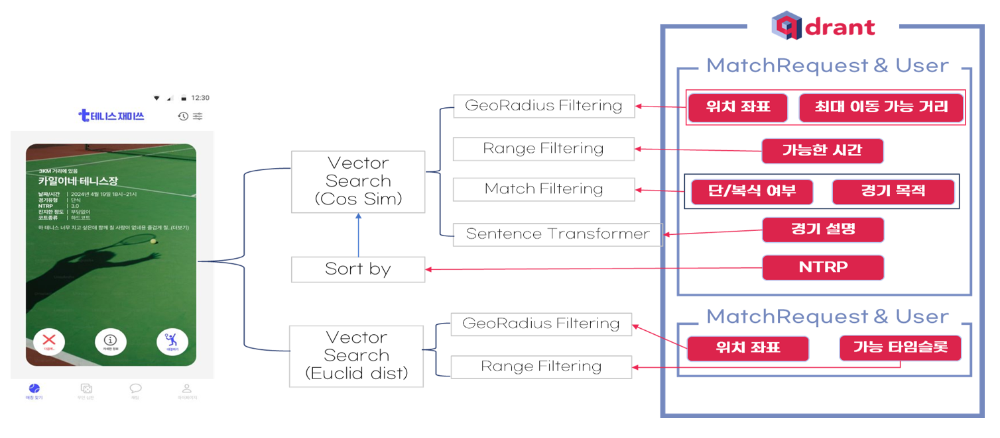
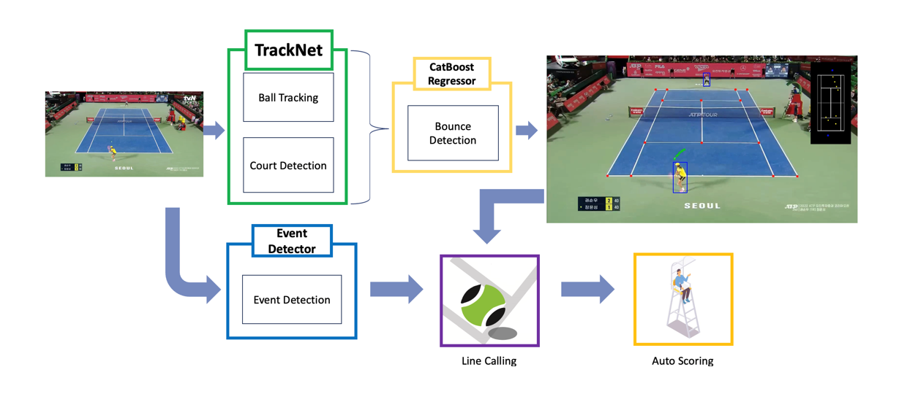

<div align=center>
	<h3>📚 Tech Stack 📚</h3>
	<p>✨ Platforms & Languages ✨</p>
</div>
<div align="center">
    <br/>
    
    
	
<br/>    
    
    
    
<br/>
	
 	
<br/>
 	
 	

</div>
<br>
<div align=center>
	<p>🛠 Tools 🛠</p>
</div>
<div align=center>
	
<br/>
	


</div>
<br>

## 프로젝트 개요
테니스 파트너 & 코트 매칭 및 무인심판 서비스
<br/>
AI 기반 개인 맞춤형 테니스 플레이어 및 테니스 코트 매칭 기능, 비전 AI 기반 라인콜링 및 오토 스코어링 기능을 제공하는 올인원 테니스 매칭 플랫폼 입니다.


## 프로젝트 주요 기능


테니스 재미쓰는은 두 가지 메인 기능을 통해 테니스 플레이어에게 편의 기능을 제공합니다.


## 프로젝트 상세정보

2024-1학기 아주대학교 SW캡스톤디자인 과목에서 JolUpHoSoIn 팀이 2024년 3월부터 6월까지 진행하였습니다.

아래의 링크에서 보다 자세하게 프로젝트를 확인할 수 있습니다.
- softcon: https://softcon.ajou.ac.kr/works/works.asp?uid=1801 (아주대학교 소프트콘)
  <br/>

## 프로젝트 레포지토리
<br/>
AI, 프론트엔드, 백엔드 레포지토리를 아래 링크에서 확인하실 수 있습니다.
<br/>

- AI: https://github.com/JolUpHoSoIn-sd24/tennisfunai
- frontend: https://github.com/JolUpHoSoIn-sd24/tennisfunapp
- backend: https://github.com/JolUpHoSoIn-sd24/tennisfunserver

<br/>

### 팀 소개

|이름|역할| email              |github|
|---|---|--------------------|---|
|송정우|AI 개발| jws5346@ajou.ac.kr  |https://github.com/KyleJSong|


<br/>


## Installation && Dependency

- 해당 repository를 clone합니다.
	```
	git clone https://github.com/JolUpHoSoIn-sd24/tennisfunai.git && cd tennis_ai
	```

- 기호에 맞게 pypl로 requirements.txt를 설치하거나 conda 가상환경을 생성합니다.

	- without conda
		```
		pip install -r requirements.txt
		```

	- with conda
		```
		conda env create -f environment.yaml && conda activate tp
		```

	- with Docker(ToDo)
		```
		```

## 매칭 추천 AI

### 개요



### 실행

./tennis-matching/scripts 파일에 실행 스크립트가 있습니다.

* 기존 collection reset
	```
	bash ./scripts/reset.sh
	```

* 기존 collection reset 후 MongoDB 내 데이터에 대해서 Vector Embedding & Qdrant Upsert
	```
	bash ./scripts/makeall.sh
	```

* MongoDB에 새로 insert되는 데이터 트래킹 & 실시간 추천 서버 실행
	```
	bash ./scripts/run.sh
	```

### 동작원리

**A. 사전 Qdrant 구축**

1. MongoDB 내 'MatchResult' 콜렉션 삭제 후 재생성
2. MongoDB 'MatchRequest'와 'User'를 aggregation 한 후, Qdrant에 upsert
3. 2번 결과 다 뽑으면 MongoDB 'MatchResult'에 Insert
4. MongoDB 'court'와 'timeslots'를 agrregation한 후, Qdrant에 upsert

**B. 추천 방법**

1. 모든 'MatchRequest'쌍에 대해서 Description 임베딩의 유사도(cos sim)를 기반으로 추천
	- 이 때, 단복식여부가 다르면 필터링됨.
	- 경기목적은 'ANY'는 다 걸리고, 'FUN', 'INTENSE'는 같은거 + 상대방 ANY만 걸림
	- 위치는 추천받는 사람 기준 maxDistance 반지름으로 원형 그려서 그 범위 밖은 필터링함.
	- 시간은 startTime~endTime 교집합만 있으면 됨. 구체적인 시간 설정은 이후 단계에서 진행.
2. 모든 'MatchRequst'쌍에 대해서 중간 좌표 기준으로 거리(유클리드 디스턴스)를 기반으로 테니스장 추천
	- startTime, endTime, minTime, maxTime 연산은 여기서 일어남.
	- 시간 픽스하고 timeslot 조회에서 열려있으면('BEFORE') 조회
3. 이후 나와 상대의 ntrp 차이 순으로 오름차순 정렬

**C. 수정/삭제**
1. matchRequest, user, court가 삭제될 경우 Qdrant에 반영됨.
2. 다만, 추천시에는 정보를 다 활용하므로 MongoDB는 업데이트 따로 해야함. => matchRequest-user aggregation을 쓰기 때문에 둘 중 하나는 지우고 하나는 살리면 쓰레기 데이터가 됨.
3. 게임이 생성될 시 Qdrant 코트에서 타임슬롯이 업데이트데고 Qdrant matchRequest-user aggregation이 삭제됨.
4. 이외의 모든 케이스는 Qdrant에서 관여하지 않음.

## 무인 심판 AI



## ToDo

- [ ] 무인 심판 AI - 프론트 연동
- [ ] 무인 심판 AI - 배포용 코드 정리
- [ ] Docker 환경 세팅 

## References

[tennis-tracking](https://github.com/ArtLabss/tennis-tracking)

[TennisProject](https://github.com/yastrebksv/TennisProject)

[Tennis](https://github.com/HaydenFaulkner/Tennis)